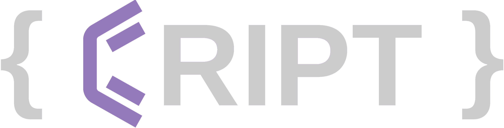

# Home

**CRIPT** (the _Community Resource for Innovation in Polymer Technology_) is a web-based platform for capturing and sharing polymer data. In addition to a user interface, CRIPT enables programmatic access to the platform through the CRIPT Python SDK, which interfaces with a REST API.

CRIPT offers multiple options to upload data, and scientists can pick the method that best suits them. Using the SDK to upload is a great choice if you have a large amount of data, stored it in an unconventional way, and know some python programming. You can easily use a library such as <a href="https://pandas.pydata.org/" target="_blank">Pandas</a> or <a href="https://numpy.org/" target="_blank">Numpy</a> to parse your data, create the needed CRIPT objects/nodes and upload them into CRIPT. 

Another great option can be the <a href="https://c-accel-cript.github.io/cript-excel-uploader/" target="_blank">Excel Uploader</a> for scientists that do not have past Python experience or would rather easily input their data into the CRIPT Excel Template.

This documentation shows how to [quickly get started](./quickstart/) with the SDK, describes the various Python methods for interacting with the [API](./api/), and provides definitions and source code for [Nodes](./data_model/nodes/) and [Subobjects](./data_model/subobjects/) from the CRIPT Data Model.